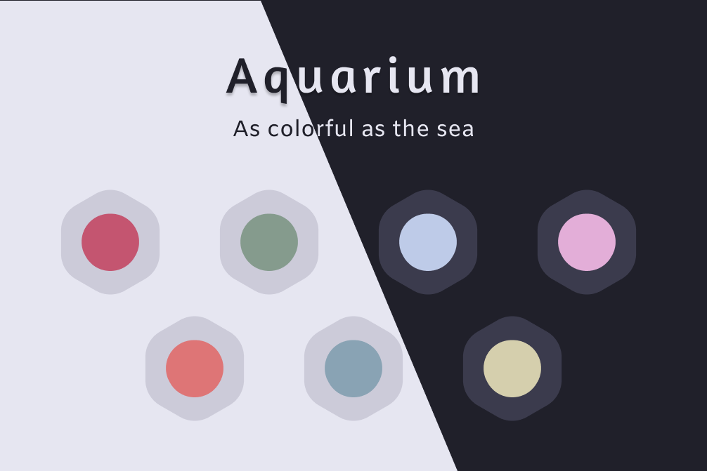
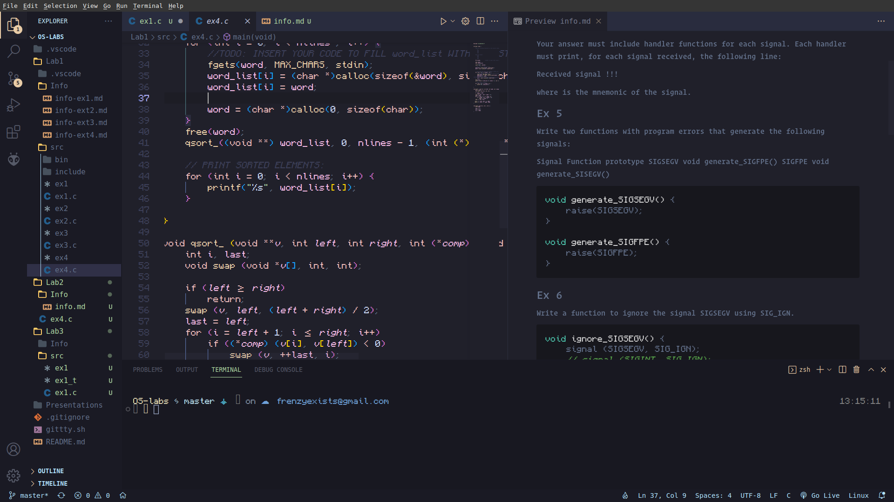

# Aquarium

<p align="center">
    <a href="https://github.com/FrenzyExists" target="_blank">
        
    </a>
</p>

<p align="center">
    <a href="https://github.com/FrenzyExists/aquarium-vscode/stargazers"></a>
    <a href="https://github.com/FrenzyExists/aquarium-vscode/releases/latest"></a> 
    <a href="https://github.com/FrenzyExists/aquarium-vscode/issues"></a>
    <a href="https://github.com/FrenzyExists/aquarium-vscode/network/members"></a>
</p>

<br/>

<p align="center">A colorful, dark cozy <a href="https://github.com/VSCodium/vscodium">Vscode</a> colorscheme.</p>



Originally a [Neovim](https://github.com/FrenzyExists/aquarium-vim) theme. I wish for this theme to be portable on all kinds of platforms. At the time of this writting is ported to:

- Neovim
- Nvchad
- Vscode (oh hey its this one!)
- Kitty terminal
- Alacritty terminal

Some of these ports are available at [my dotfiles](https://github.com/FrenzyExists/dotfiles).


## Getting Started
At the moment the theme is only available here at this repo. I'm not a big fan of Azure basically asking for me to give them my soul.

### Quick Start

Download the .vsix file and under the `...` at the extensions section at the top you'll get a menu. Click on `Install from .vsix` and click the .vsix file.

## Languages
The theme is taylored for

- Javascript + JSX
- Rust
- C++
- JSON
- Python
- Ruby
- Shell
- HTML
- C#
- CSS
- YAML
- Markdown


### Recommended Settings

```
{
    "editor.cursorSmoothCaretAnimation" : true,
    "editor.cursorBlinking": "expand",
    "editor.overviewRulerBorder": false,
    "editor.showFoldingControls" :"mouseover",
    "editor.renderWhitespace": "none",
    "editor.fontFamily": "Input Mono, SFMono-UltraLight, SourceCodePro-Light, Menlo, Monaco, 'Courier New', monospace",
    "editor.fontWeight": "200",
    "window.titleBarStyle":"custom",
    "editor.quickSuggestionsDelay": 0,
}
```

<p align="center">
    <a href="https://github.com/frenzyexists/aquarium-vscode/blob/main/LICENSE">
        
    </a>
</p>
